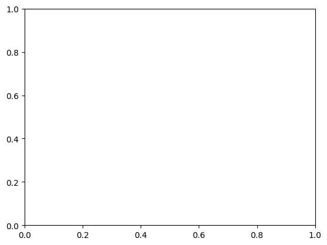

# Matplotlib

#### Data Visualiztion

<ul>
    <li>Data visualization is about viewing or visualizing data in the form of graphical plots, chast, figures, and animations.</li>
    <li>It is an effective way of communicating information to others.</li>
    <li>Libraries: 

* [Altair](https://github.com/altair-viz/altair) - Declarative statistical visualization library for Python.
* [Bokeh](https://github.com/bokeh/bokeh) - Interactive Web Plotting for Python.
* [bqplot](https://github.com/bloomberg/bqplot) - Interactive Plotting Library for the Jupyter Notebook.
* [Cartopy](https://github.com/SciTools/cartopy) - A cartographic python library with matplotlib support.
* [Dash](https://plot.ly/products/dash/) - Built on top of Flask, React and Plotly aimed at analytical web applications.
* [diagrams](https://github.com/mingrammer/diagrams) - Diagram as Code.
* [Matplotlib](http://matplotlib.org/) - A Python 2D plotting library.
* [plotnine](https://github.com/has2k1/plotnine) - A grammar of graphics for Python based on ggplot2.
* [Pygal](http://www.pygal.org/en/latest/) - A Python SVG Charts Creator.
* [PyGraphviz](https://pypi.org/project/pygraphviz/) - Python interface to [Graphviz](http://www.graphviz.org/).
* [PyQtGraph](http://www.pyqtgraph.org/) - Interactive and realtime 2D/3D/Image plotting and science/engineering widgets.
* [Seaborn](https://github.com/mwaskom/seaborn) - Statistical data visualization using Matplotlib.
* [VisPy](https://github.com/vispy/vispy) - High-performance scientific visualization based on OpenGL.
</ul>

### Matplotlib
Matplotlib is a plotting library for the Python programming language and its numerical mathematics extension NumPy. It provides an object-oriented API for embedding plots into applications using general-purpose GUI toolkits like Tkinter, wxPython, Qt, or GTK+.

<ul>
    <li>Orgainzed in hierarchy</li>
    <li>top-level <b>matplotlib.pypplot</b> module is present</li>
    <li>pyplot is used for few activity such as figure creation, </li>
    <li>Through the created figure, one or more axes/subplot object are created</li>
    <li>Axes object can further use for doing many plotting actions.</li>
</ul>


```python
#import library
import numpy as np
import matplotlib
import matplotlib.pyplot as plt
%matplotlib inline
```


```python
#install matplotlib
!pip install matplotlib
```

    Requirement already satisfied: matplotlib in c:\users\mritu\anaconda3\lib\site-packages (3.8.0)
    Requirement already satisfied: contourpy>=1.0.1 in c:\users\mritu\anaconda3\lib\site-packages (from matplotlib) (1.0.5)
    Requirement already satisfied: cycler>=0.10 in c:\users\mritu\anaconda3\lib\site-packages (from matplotlib) (0.11.0)
    Requirement already satisfied: fonttools>=4.22.0 in c:\users\mritu\anaconda3\lib\site-packages (from matplotlib) (4.25.0)
    Requirement already satisfied: kiwisolver>=1.0.1 in c:\users\mritu\anaconda3\lib\site-packages (from matplotlib) (1.4.4)
    Requirement already satisfied: numpy<2,>=1.21 in c:\users\mritu\anaconda3\lib\site-packages (from matplotlib) (1.24.3)
    Requirement already satisfied: packaging>=20.0 in c:\users\mritu\anaconda3\lib\site-packages (from matplotlib) (23.0)
    Requirement already satisfied: pillow>=6.2.0 in c:\users\mritu\anaconda3\lib\site-packages (from matplotlib) (9.4.0)
    Requirement already satisfied: pyparsing>=2.3.1 in c:\users\mritu\anaconda3\lib\site-packages (from matplotlib) (3.0.9)
    Requirement already satisfied: python-dateutil>=2.7 in c:\users\mritu\anaconda3\lib\site-packages (from matplotlib) (2.8.2)
    Requirement already satisfied: six>=1.5 in c:\users\mritu\anaconda3\lib\site-packages (from python-dateutil>=2.7->matplotlib) (1.16.0)
    


```python
#get matplotlib version
matplotlib.__version__
```


    '3.8.0'


```python
#upgrade matplotlib
!pip install --upgrade matplotlib
```

    Requirement already satisfied: matplotlib in c:\users\mritu\anaconda3\lib\site-packages (3.8.0)
    Requirement already satisfied: contourpy>=1.0.1 in c:\users\mritu\anaconda3\lib\site-packages (from matplotlib) (1.0.5)
    Requirement already satisfied: cycler>=0.10 in c:\users\mritu\anaconda3\lib\site-packages (from matplotlib) (0.11.0)
    Requirement already satisfied: fonttools>=4.22.0 in c:\users\mritu\anaconda3\lib\site-packages (from matplotlib) (4.25.0)
    Requirement already satisfied: kiwisolver>=1.0.1 in c:\users\mritu\anaconda3\lib\site-packages (from matplotlib) (1.4.4)
    Requirement already satisfied: numpy<2,>=1.21 in c:\users\mritu\anaconda3\lib\site-packages (from matplotlib) (1.24.3)
    Requirement already satisfied: packaging>=20.0 in c:\users\mritu\anaconda3\lib\site-packages (from matplotlib) (23.0)
    Requirement already satisfied: pillow>=6.2.0 in c:\users\mritu\anaconda3\lib\site-packages (from matplotlib) (9.4.0)
    Requirement already satisfied: pyparsing>=2.3.1 in c:\users\mritu\anaconda3\lib\site-packages (from matplotlib) (3.0.9)
    Requirement already satisfied: python-dateutil>=2.7 in c:\users\mritu\anaconda3\lib\site-packages (from matplotlib) (2.8.2)
    Requirement already satisfied: six>=1.5 in c:\users\mritu\anaconda3\lib\site-packages (from python-dateutil>=2.7->matplotlib) (1.16.0)
    


```python
#get matplotlib version after upgrade
matplotlib.__version__
```


    '3.8.0'


### Parts of Matplotlib 

<ol>
    <li>Figure: Whole area chosen for plotting</li>
    <li>Axes: Area where data is plotted</li>
    <li>Axis: Number-line link objects, which define graph limits (x, y axis)</li>
    <li>Artist: Every element on the figure is an artist (Major and Minor tick table)</li>
</ol>

### Figure

<ul>
    <li>It refer to the whole area or page on which everything is drawn.</li>
    <li>It include Axes, Axis and other Artist element</li>
    <li>Figure is created using <b>figure</b> function of pyplot module</li>
</ul>


```python
#create figure using plt.figure() return figure object
fig = plt.figure()

# Viewing figure to display figure need to tell explicitly pyplot to display it
# below command will return the object to display figure it required at least one axes.
plt.show()
```


    <Figure size 640x480 with 0 Axes>


### Axes

<ul>
    <li>Axes is the region of the figure, available for plotting data</li>
    <li>Axes object is associated with only one Figure</li>
    <li>Figure can contain one or more number of Axes element</li>
    <li>Axes contain two Axis object in case of 2D plots and three object in case of 3D plots</li>
</ul>


```python
#Axes can be added by using methods add_subplot(nrows, ncols, index) return axes object
fig = plt.figure()
ax = fig.add_subplot()
plt.show()
```


    

    


```python
#Adjusting Figure Size => plt.figure(figsize=(x, y))
fig = plt.figure(figsize=(3, 3))
ax = fig.add_subplot(1, 1, 1)
plt.show()
```


    

    


```python
#setting title and axis label as parameter
fig = plt.figure(figsize=(10,3))
ax = fig.add_subplot(1,1,1)
ax.set(title="Figure"
      , xlabel='x-asix'
      , ylabel='y-axis'
      , xlim=(0,5)
      , ylim=(0,10)
      , xticks=[0.1, 0.9, 2, 3, 4, 5]
      , xticklabels=['pointone', 'pointnine', 'two', 'three', 'four', 'five'])
plt.show()
```


    

    


```python
#setting title and axis label as method
fig = plt.figure(figsize=(3,3))
ax = fig.add_subplot(111)
ax.set_title("Figure")
ax.set_xlabel("X-Axis")
ax.set_ylabel('Y-Axis')
ax.set_xlim([0,5])
ax.set_ylim([0,10])
plt.show()
```


    

    


```python
#setting title and axis label eplicitly
fig = plt.figure(figsize=(3,3))
ax = fig.add_subplot(1,1,1)

plt.title('Figure')
plt.xlabel('X-Axis')
plt.ylabel('Y-Axis')
plt.xlim(0,5)
plt.ylim(0,10)
plt.show()
```


    

    


```python
#plot data points in graph => plt.plot(x, y) will use
x = list(range(0,5))
y = list(range(0,10, 2))

fig = plt.figure(figsize=(3,3))
ax = fig.add_subplot(1,1,1)
ax.set(title="Figure"
      , xlabel='x-asix'
      , ylabel='y-axis'
      , xlim=(0,5)
      , ylim=(0,10))
plt.plot(x,y)
plt.show()
```


    

    


```python
#adding legend in graph => plt.legend(x, y, label='legend'); plt.legend() will use
x = list(range(0,5))
y = list(range(0,10, 2))

fig = plt.figure(figsize=(3,3))
ax = fig.add_subplot(1,1,1)
ax.set(title="Figure"
      , xlabel='x-asix'
      , ylabel='y-axis'
      , xlim=(0,5)
      , ylim=(0,10))
plt.plot(x,y, label='legend')
plt.legend()
plt.show()
```


    

    


### Types Of Plot

1. Line plot
2. Scatter plot
3. Bar plot
4. Pie plot
5. Histogram
6. Box plot

### Line Plot

* Line Plot is used to visualize a trend in data.
* Line Plot is also used to compare two variables.
* Line Plots are simple and effective in communicating.
* plot function is used for drawing Line plots.
* Syntax: plt.plot(x,y)


```python
x = [1, 5, 8, 12, 15, 19, 22, 26, 29]
y = [29.3, 30.1, 30.4, 31.5, 32.3, 32.6, 31.8, 32.4, 32.7]

fig = plt.figure(figsize=(8,6))
ax = fig.add_subplot(1,1,1)
ax.set(title='Line Plot Graph'
       , xlabel='X-Axis'
       , ylabel='Y-Axis'
       , xlim=(0, 30)
       , ylim=(25, 35))
ax.plot(x, y)
plt.show()
```


    

    


### Parameter for Plot 

* color - Sets the color of the line.
* linestyle - Sets the line style, e.g., solid, dashed, etc.
* linewidth - Sets the thickness of a line.
* marker - Chooses a marker for data points, e.g., circle, triangle, etc.
* markersize - Sets the size of the chosen marker.
* label - Names the line, which will come in legend.


```python
fig = plt.figure(figsize=(6,3))
ax = fig.add_subplot(1,1,1)
ax.set(title='Line Plot Graph'
       , xlabel='X-Axis'
       , ylabel='Y-Axis'
       , xlim=(0, 30)
       , ylim=(25, 35))
ax.plot(x
        , y
        , color='blue'
        , linestyle='dotted'
        , linewidth=1
        , marker='*'
        , markersize=10
        , label='label')
plt.legend()
plt.show()
```


    

    


### Multiple line with single plot function


```python
x=[1,4,6,8,2]
y=[10,10,1,5,0]

fig = plt.figure(figsize=(8,4))
ax = fig.add_subplot()
ax.plot(x, y, 'g<', x,y, 'r--')

```


    [<matplotlib.lines.Line2D at 0x24716e40890>,
     <matplotlib.lines.Line2D at 0x24718806550>]


    

    


### Scatter Graph

* It similar to line graph
* Used to show how one variable is related to another
* It consist of data point, if it in linear then it higly corelated
* It only mark the data point.
* Syntax: plt.scatter(x,y)

### Parameter of Scatter Graph

* c: Sets color of markers.
* s: Sets size of markers.
* marker: Selects a marker. e.g: circle, triangle, etc
* edgecolor: Sets the color of lines on edges of markers.


```python
x=[1,4,6,8,2]
y=[10,10,1,5,0]

fig = plt.figure(figsize=(8,4))
ax = fig.add_subplot()
ax.scatter(x
           , y
           , c='red'
           , s=500
           , marker='*'
           , edgecolor='blue'
           , label='scatter')
ax.set_title('Scatter')
ax.set_xlabel('X-Axis')
ax.set_ylabel('Y-Axis')
plt.legend()
```


    <matplotlib.legend.Legend at 0x24718801890>


    

    


### Bar Chart

* It mostly used to compare categories
* bar is used for vertical bar plots
* barh is used for horizontal bar plots
* Syntax: bar(x, height) or bar(y,width)

### Parameter of Bar Graph

* color: Sets the color of bars.
* edgecolor: Sets the color of the border line of bars.
* label: Sets label to a bar, appearing in legend.
* color: color of bar
* align: Aligns the bars w.r.t x-coordinates

##### bar(x,width)
* width: Sets the width of bars

#### barh(y,height)
* height: Sets the height of bars


```python
#vertical bar graph
x = [1, 2, 3]
y = [10,20,30]

fig = plt.figure(figsize=(8,4))
ax = fig.add_subplot()

ax.set(title='Bar Graph'
       , xlabel='X-Axis'
       , ylabel='Y-Axis'
       , xticks=x
       , label='label'
       , xticklabels=['first', 'second', 'third'])
ax.bar(x
       , y
       , color='green'
       , edgecolor='red'
       , width=0.5
       , align='edge'
       , label='label'
       , linewidth=5)

plt.legend()
plt.show()
```


    

    


```python
#horizontal bar graph
x = [1, 2, 3]
y = [10,20,30]

fig = plt.figure(figsize=(8,4))
ax = fig.add_subplot()

ax.set(title='Bar Graph'
       , xlabel='X-Axis'
       , ylabel='Y-Axis'
       , xticks=x
       , label='label'
       , xticklabels=['first', 'second', 'third'])
plt.barh(x
       , y
       , color='green'
       , edgecolor='red'
       , height=0.5
       , align='edge'
       , label='label')

plt.legend()
plt.show()
```


    

    


### Error Bar

* It is used to plot y versus x as lines and/or markers with attached errorbars.

### Parameter of Error Bar

* ecolor: it is the color of the errorbar lines.
* elinewidth: it is the linewidth of the errorbar lines.
* capsize: it is the length of the error bar caps in points.
* barsabove: It contains boolean value True for plotting errorsbars above the plot symbols. Its default value is False.
* Syntax: errorbar()


```python
a = [1, 3, 5, 7]
b = [11, 2, 4, 19]
c = [1, 1, 1, 1]
d = [4, 3, 2, 1]

fig=plt.figure(figsize=(4,4))
ax=fig.add_subplot()
plt.bar(a, b) 
plt.errorbar(a, b, xerr=c, yerr=d, fmt="^", color="r")
```


    <ErrorbarContainer object of 3 artists>


    

    


### Pie Plot

* It is effective in showing the proportion of categories.
* It is best suited for comparing fewer categories.
* It is used to highlight proportion of one or a group of categories.
* Syntax: pie(x), x: size of portions, passed as fraction or number

### Parameter of Pie

* colors: Sets the colors of portions.
* labels: Sets the labels of portions.
* startangle: Sets the start angle at which portion drawing starts.
* autopct: Sets the percentage display format of an area, covering portions.


```python
x=[1,2,3,4,5]

fig=plt.figure(figsize=(4,4))
ax=fig.add_subplot()
ax.set(title='Pie')

plt.pie(x
       , colors=['brown', 'red', 'green', 'yellow', 'blue']
       , labels=['first', 'second', 'third', 'fourth', 'fifth']
       , startangle=0
       , autopct='%1.1f%%')
```


    ([<matplotlib.patches.Wedge at 0x2471900da10>,
      <matplotlib.patches.Wedge at 0x247189a1f10>,
      <matplotlib.patches.Wedge at 0x247189a26d0>,
      <matplotlib.patches.Wedge at 0x247189a2c10>,
      <matplotlib.patches.Wedge at 0x247189670d0>],
     [Text(1.075962358309037, 0.22870287165240302, 'first'),
      Text(0.7360436312779136, 0.817459340184711, 'second'),
      Text(-0.33991877217145816, 1.046162142464278, 'third'),
      Text(-1.0759623315431446, -0.2287029975759841, 'fourth'),
      Text(0.5500001932481627, -0.9526278325909777, 'fifth')],
     [Text(0.5868885590776565, 0.12474702090131072, '6.7%'),
      Text(0.4014783443334074, 0.4458869128280241, '13.3%'),
      Text(-0.18541023936624987, 0.5706338958896061, '20.0%'),
      Text(-0.5868885444780788, -0.12474708958690041, '26.7%'),
      Text(0.3000001054080887, -0.5196151814132605, '33.3%')])


    

    


### Histogram Chart

* It used to visualize the spread of data of a distribution
* Syntax: hist(x), x is the data values

### Parameter of Histogram

* color: Sets the color of bars.
* bins: Sets the number of bins to be used.
* density: Sets to True where bins display fraction and not the count.


```python
x=[1,2,3,4,5]

fig=plt.figure(figsize=(20,4))
ax=fig.add_subplot()

ax.set(title='Histogram'
      , xlabel='X-Axis'
      , ylabel='Y-Axis')

ax.hist(x
       , color='red'
       , bins=10
       , density=True
       , orientation='vertical')
```


    (array([0.5, 0. , 0.5, 0. , 0. , 0.5, 0. , 0.5, 0. , 0.5]),
     array([1. , 1.4, 1.8, 2.2, 2.6, 3. , 3.4, 3.8, 4.2, 4.6, 5. ]),
     <BarContainer object of 10 artists>)


    

    


### Box Plot

It is a type of chart that depicts a group of numerical data through their quartiles. It is a simple way to visualize the shape of our data. It makes comparing characteristics of data between categories very easy.

* Box plots are also used to visualize the spread of data.
* Box plots are used to compare distributions.
* Box plots can also be used to detect outliers.
* Syntax: boxplot(x)

### Parameter of Box Plot

* labels: Sets the labels for box plots.
* notch: Sets to True if notches need to be created around the median.
* bootstrap: Number set to indicate that notches around the median are bootstrapped.
* vert: Sets to False for plotting Box plots horizontally.


```python
x=[1,2,3,4,5]

fig=plt.figure(figsize=(20,10))
ax=fig.add_subplot()

ax.set(title='Histogram'
      , xlabel='X-Axis'
      , ylabel='Y-Axis')

ax.boxplot(x
          , labels=['start']
          , notch=False
          , bootstrap=10000
          , vert=True)
```


    {'whiskers': [<matplotlib.lines.Line2D at 0x24716eae810>,
      <matplotlib.lines.Line2D at 0x24716eadd10>],
     'caps': [<matplotlib.lines.Line2D at 0x24716eadd50>,
      <matplotlib.lines.Line2D at 0x24716ed9790>],
     'boxes': [<matplotlib.lines.Line2D at 0x24716eacb50>],
     'medians': [<matplotlib.lines.Line2D at 0x24716edb390>],
     'fliers': [<matplotlib.lines.Line2D at 0x247187d9d10>],
     'means': []}


    

    


```python
np.random.seed(100)
x = 50 + 10*np.random.randn(1000)
y = 70 + 25*np.random.randn(1000)
z = 30 + 5*np.random.randn(1000)
fig = plt.figure(figsize=(8,6))
ax = fig.add_subplot(111)
ax.set(title="Box plot with outlier",
      xlabel='x-Axis', ylabel='Y-Axis')
ax.boxplot([x, y, z]
           , labels=['A', 'B', 'C']
           , notch=True
           , bootstrap=10000)
plt.show()
```


    

    


### Matplotlib Styles


```python
plt.style.available
```


    ['Solarize_Light2',
     '_classic_test_patch',
     '_mpl-gallery',
     '_mpl-gallery-nogrid',
     'bmh',
     'classic',
     'dark_background',
     'fast',
     'fivethirtyeight',
     'ggplot',
     'grayscale',
     'seaborn-v0_8',
     'seaborn-v0_8-bright',
     'seaborn-v0_8-colorblind',
     'seaborn-v0_8-dark',
     'seaborn-v0_8-dark-palette',
     'seaborn-v0_8-darkgrid',
     'seaborn-v0_8-deep',
     'seaborn-v0_8-muted',
     'seaborn-v0_8-notebook',
     'seaborn-v0_8-paper',
     'seaborn-v0_8-pastel',
     'seaborn-v0_8-poster',
     'seaborn-v0_8-talk',
     'seaborn-v0_8-ticks',
     'seaborn-v0_8-white',
     'seaborn-v0_8-whitegrid',
     'tableau-colorblind10']


```python
plt.style.use('ggplot')
```


```python
plt.style.context('ggplot')
```


    <contextlib._GeneratorContextManager at 0x24718952750>


```python
x = [1, 5, 8, 12, 15, 19, 22, 26, 29]
y = [29.3, 30.1, 30.4, 31.5, 32.3, 32.6, 31.8, 32.4, 32.7]

with plt.style.context(['dark_background', 'ggplot']):
    fig = plt.figure(figsize=(8,6))
    ax = fig.add_subplot(111)
    ax.set(title='ggplot'
           , xlabel='X-Axis'
           , ylabel='Y-Axis'
           , xlim=(0, 30)
           , ylim=(25, 35))    
    ax.plot(x, y, color='green', linestyle='--', linewidth=3)
    plt.show()
```


    

    


```python
sepal_len=[6.01,6.94,7.59]
sepal_wd=[4.42,3.77,3.97]
petal_len=[2.46,5.26,6.55]
petal_wd=[1.24,2.33,3.03]
species=['setosa','versicolor','virginica']
species_index1=[0.8,1.8,2.8]
species_index2=[1.0,2.0,3.0]
species_index3=[1.2,2.2,3.2]
species_index4=[1.4,2.4,3.4]

with plt.style.context('ggplot'):
    fig = plt.figure(figsize=(9,7))
    ax = fig.add_subplot()
    ax.bar(species_index1
           , sepal_len
           , width=0.2
           , label='Sepal Width'
          )
    ax.bar(species_index2
           , sepal_wd
           , width=0.2
           , label='Sepal Width'
          )
    ax.bar(species_index3
           , petal_len
           , width=0.2
           , label='Petal Length'
          )
    ax.bar(species_index4
           , petal_wd
           , width=0.2
           , label='Petal Width'
          )
    
    ax.set(xlabel='Species'
           , ylabel='Iris Measurements (cm)'
           , title='Mean Measurements of Iris Species'
           , xlim=(0.5,3.7)
           , ylim=(0,10)
           , xticks=species_index2
           , xticklabels=species
          )
```


    

    


### Custom Style

* A style sheet is a text file having extension .mplstyle.
* All custom style sheets are placed in a folder, stylelib, present in the config directory of matplotlib.
* Create a file mystyle.mplstyle with the below-shown contents and save it in the folder <matplotlib_configdir/stylelib/.
* Reload the matplotlib library with the subsequent expression.
* Use the below expression for knowing the Config folder.


```python
#Reload the matplotlib library with the subsequent expression.
print(matplotlib.get_configdir())
```

    C:\Users\mritu\.matplotlib
    

### Create a file mystyle.mplstyle with the below-shown contents and save it in the folder <matplotlib_configdir/stylelib/.

* axes.titlesize : 24
* axes.labelsize : 20
* lines.linewidth : 8
* lines.markersize : 10
* xtick.labelsize : 16
* ytick.labelsize : 16

Reload the matplotlib library with the subsequent expression.
```matplotlib.style.reload_library()```


```python
print(plt.style.available)
```

    ['Solarize_Light2', '_classic_test_patch', '_mpl-gallery', '_mpl-gallery-nogrid', 'bmh', 'classic', 'dark_background', 'fast', 'fivethirtyeight', 'ggplot', 'grayscale', 'seaborn-v0_8', 'seaborn-v0_8-bright', 'seaborn-v0_8-colorblind', 'seaborn-v0_8-dark', 'seaborn-v0_8-dark-palette', 'seaborn-v0_8-darkgrid', 'seaborn-v0_8-deep', 'seaborn-v0_8-muted', 'seaborn-v0_8-notebook', 'seaborn-v0_8-paper', 'seaborn-v0_8-pastel', 'seaborn-v0_8-poster', 'seaborn-v0_8-talk', 'seaborn-v0_8-ticks', 'seaborn-v0_8-white', 'seaborn-v0_8-whitegrid', 'tableau-colorblind10']
    

### matplotlibrc file ###

* matplotlib uses all the settings specified in matplotlibrc file.
* These settings are known as rc settings or rc parameters.
* For customization, rc settings can be altered in the file or interactively.
* The location of active matplotlibrc file used by matplotlib can be found with below expression.


```python
import matplotlib
matplotlib.matplotlib_fname()
```


    'C:\\Users\\mritu\\anaconda3\\Lib\\site-packages\\matplotlib\\mpl-data\\matplotlibrc'


### Matplotlib rcParams

* All rc settings, present in matplotlibrc file are stored in a dictionary named matplotlib.rcParams.
* Any settings can be changed by editing values of this dictionary.


```python
import matplotlib as mpl
mpl.rcParams['lines.linewidth'] = 2
mpl.rcParams['lines.color'] = 'r'
```


```python
plt.style.available
```


    ['Solarize_Light2',
     '_classic_test_patch',
     '_mpl-gallery',
     '_mpl-gallery-nogrid',
     'bmh',
     'classic',
     'dark_background',
     'fast',
     'fivethirtyeight',
     'ggplot',
     'grayscale',
     'seaborn-v0_8',
     'seaborn-v0_8-bright',
     'seaborn-v0_8-colorblind',
     'seaborn-v0_8-dark',
     'seaborn-v0_8-dark-palette',
     'seaborn-v0_8-darkgrid',
     'seaborn-v0_8-deep',
     'seaborn-v0_8-muted',
     'seaborn-v0_8-notebook',
     'seaborn-v0_8-paper',
     'seaborn-v0_8-pastel',
     'seaborn-v0_8-poster',
     'seaborn-v0_8-talk',
     'seaborn-v0_8-ticks',
     'seaborn-v0_8-white',
     'seaborn-v0_8-whitegrid',
     'tableau-colorblind10']


### Subplots

It provides a way to plot multiple plots on a single figure. Given the number of rows and columns, it returns a tuple (fig, ax), giving a single figure fig with an array of axes ax.

* subplot creates the Axes object at index position and returns it.

```python
# 'index' is the position in a virtual grid with 'nrows' and 'ncols'
# 'index' number varies from 1 to `nrows*ncols`.
subplot(nrows, ncols, index)
```


```python
fig = plt.figure(figsize=(10,8))
ax1 = plt.subplot(2, 2, 1, title='Plot1')
ax2 = plt.subplot(2, 2, 2, title='Plot2')
ax3 = plt.subplot(2, 2, 3, title='Plot3')
ax4 = plt.subplot(2, 2, 4, title='Plot4')
plt.show()
```


    

    


```python
fig = plt.figure(figsize=(10,8))

ax1 = plt.subplot(2, 2, (1,2), title='Plot1')
ax1.set_xticks([])
ax1.set_yticks([])

ax2 = plt.subplot(2, 2, 3, title='Plot2')
ax2.set_xticks([])
ax2.set_yticks([])

ax3 = plt.subplot(2, 2, 4, title='Plot3')
ax3.set_xticks([])
ax3.set_yticks([])
plt.show()
```


    

    


### Subplots Using 'GridSpec'

* GridSpec class of matplotlib.gridspec can also be used to create Subplots.
* Initially, a grid with given number of rows and columns is set up.
* Later while creating a subplot, the number of rows and columns of grid, spanned by the subplot are provided as inputs to subplot function.


```python
import matplotlib.gridspec as gridspec

fig = plt.figure(figsize=(10,8))
gd = gridspec.GridSpec(2,2)

ax1 = plt.subplot(gd[0,:],title='Plot1')

ax2 = plt.subplot(gd[1,0])

ax3 = plt.subplot(gd[1,-1])

plt.show()
```


    

    


```python
fig = plt.figure(figsize=(10,8))
gd = gridspec.GridSpec(3,2)

ax1 = plt.subplot(gd[0,:],title='Plot1')
ax1.set_xticks([])
ax1.set_yticks([])

ax2 = plt.subplot(gd[1,0],title='Plot1')
ax2.set_xticks([])
ax2.set_yticks([])

ax3 = plt.subplot(gd[2,0],title='Plot1')
ax3.set_xticks([])
ax3.set_yticks([])

ax4 = plt.subplot(gd[1:,1],title='Plot1')
ax4.set_xticks([])
ax4.set_yticks([])

plt.show()
```


    

    


```python
np.random.seed(1500)
x=np.random.rand(10)
y=np.random.rand(10)
z=np.sqrt(x**2+y**2)

fig=plt.figure(figsize=(9,7))
fig.suptitle('Main title for all subplot')

axes1=plt.subplot(2,2,1,title='Scatter plot with Diamond Markers')
axes1.scatter(x
              , y
              , s=80
              , c=z
              , marker='d'
             )
axes1.set(xticks=(0.0,0.5,1.0,1.5)
          , yticks=(-0.2,0.2,0.6,1.0)
         )

axes2=plt.subplot(2,2,2,title='Scatter plot with Circle Markers')
axes2.scatter(x
              , y
              , s=80
              , c=z
              , marker='o'
             )
axes2.set(xticks=(0.0,0.5,1.0,1.5)
          , yticks=(-0.2,0.2,0.6,1.0)
         )

axes3=plt.subplot(2,2,3,title='Scatter plot with Plus Markers')
axes3.scatter(x
              , y
              , s=80
              , c=z
              , marker='*'
             )
axes3.set(xticks=(0.0,0.5,1.0,1.5)
          , yticks=(-0.2,0.2,0.6,1.0)
         )

axes4=plt.subplot(2,2,4,title='Scatter plot with Upper Triangle')
axes4.scatter(x
              , y
              , s=80
              , c=z
              , marker='^'
             )
axes4.set(xticks=(0.0,0.5,1.0,1.5)
          , yticks=(-0.2,0.2,0.6,1.0)
         )

plt.tight_layout()
```


    

    


```python
fig = plt.figure()
gs = gridspec.GridSpec(3, 3)
ax1 = plt.subplot(gs[:2, :2])
ax2 = plt.subplot(gs[0, 2])
ax3 = plt.subplot(gs[1, 2])
ax4 = plt.subplot(gs[-1, 0])
ax5 = plt.subplot(gs[-1, 1:])
plt.show()
```


    

    


```python
import matplotlib.gridspec as gridspec
fig = plt.figure()
gs = gridspec.GridSpec(3, 3)
ax1 = plt.subplot(gs[0, :])
ax2 = plt.subplot(gs[1, :-1])
ax3 = plt.subplot(gs[1:, -1])
ax4 = plt.subplot(gs[-1, 0])
ax5 = plt.subplot(gs[-1, -2])
plt.show()
```


    

    


### Common Pitfalls in Data Visualization

Common pitfalls to be avoided for a better Data Visualization are:

* Creating unlabelled plots.
* Using 3-Dimensional charts. Don't prefer 3-D plots, unless they add any value over 2-D charts.
* Portions of a pie plot do not sum up to meaningful number.
* Showing too many portions in a single pie chart.
* Bar charts not starting at zero.
* Failing to normalize the data.
* Adding extra labels, and fancy images.

### Best Practices of Data Visualization

Few of the best practices of Data Visualization are:

* Display the data points on the plot, whenever required.
* Whenever correlation is plotted, clarify that you have not established any cause of link between the variables.
* Prefer labeling data objects directly inside the plot, rather than using legends.
* Create a visualization, which stands by itself. Avoid adding extra text to tell more about visualization.


```python
fig=plt.figure()
a=fig.add_subplot()
a.plot(x, y, 'g^')
```


    [<matplotlib.lines.Line2D at 0x24719563990>]


    

    


```python

```
